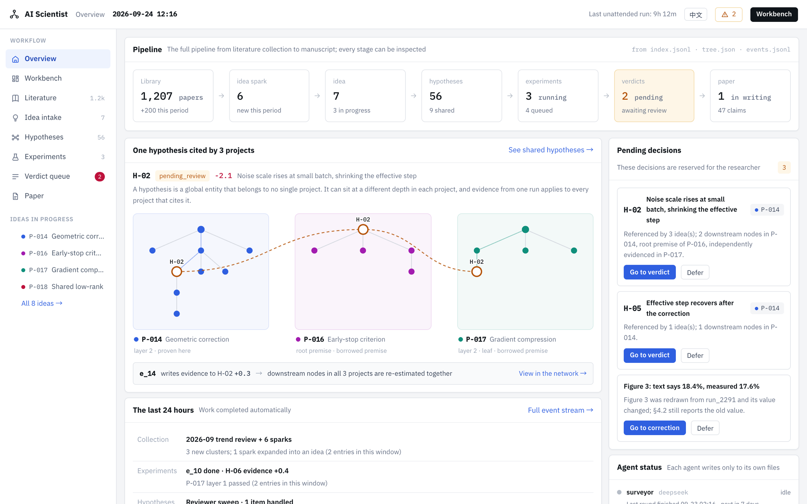

# AI Scientist: A Dynamic Hypothesis–Evidence Forest

English · [中文](README.md)

**[Live demo](https://liuguangrui.top/ai-scientist/)** · [Workbench](https://liuguangrui.top/ai-scientist/main) · [Hypothesis panorama](https://liuguangrui.top/ai-scientist/panorama) · [3D forest](https://liuguangrui.top/ai-scientist/forest3d)

This repository contains the interactive interface of an autonomous research system. The system
covers five stages (literature review, hypothesis generation, experimentation, adjudication of
evidence and manuscript writing), all of which operate on a single shared network of hypotheses.
Neither the client nor the server has third-party dependencies, and no build step is required.

The live demo uses demonstration data and simulated experiments only. All logic executes in the
browser, and the visitor's actions are stored locally.

## Core design

The system rests on one premise: **a hypothesis is a global entity and does not belong to any
single project.**

The same hypothesis may occupy different positions in the hypothesis trees of different projects:
a root premise in one, an intermediate node in another and a verified leaf in a third. Evidence
produced by a single experiment therefore applies to every project that cites the hypothesis.
When the hypothesis is rejected, the consequences for each project are computed from its position
in that project's tree. The model is described in full in [docs/CONCEPTS.md](docs/CONCEPTS.md).



---

## Functionality

Every operation in the interface modifies the system state, and the change propagates to the
dependent screens.

| Operation | System behaviour |
| --- | --- |
| Queue an experiment | The run is queued, assigned a slot, executed and completed. On completion, signed evidence is written back to its hypothesis, and every project that cites the hypothesis is updated at once. The simulation clock advances independently, so the queue continues to drain while the page is closed. |
| PROCEED / REFINE / PIVOT / escalate | After three consecutive PIVOTs without improvement, or when cumulative evidence falls below −1.0, the executor stops expanding the hypothesis and transfers it to the verdict queue. |
| Adjudicate a shared hypothesis | The impact depends on position: a project in which the hypothesis is a root premise is re-estimated in full, a project in which it is an intermediate node has the corresponding branch frozen, and a leaf supported by independent evidence is unaffected. |
| Launch a candidate project | After the existing hypotheses to be reused are selected, the new tree joins the shared network. Reused nodes gain an additional reference and are not verified again. |
| Revise the manuscript | Correcting an overclaim rewrites the corresponding sentence. Accepting a figure-review comment redraws the figure and marks its section for re-checking. While any overclaim remains unresolved, the submission version cannot be exported and the outstanding items are listed. |
| Explore the panorama | The view supports zooming, panning and dragging nodes. Shared hypotheses are placed between the projects that cite them. |

The interface is available in Chinese and English; the language preference is stored in the browser.

---

## Screens

| Group | Screens |
| --- | --- |
| Entry | `/` 3D forest homepage · `/about` system introduction · `/home` overview · `/main` workbench (global frontier) |
| Literature | `/survey` collection pipeline · `/trends` trend analysis · `/sparks` idea sparks · `/digest` paper detail |
| Intake & hypotheses | `/ideas` project intake · `/panorama` panorama · `/graph` shared hypotheses · `/tree` single-project tree · `/forest3d` `/forest2d` the forest at scale (3D / 2D) |
| Experiments | `/experiments` single run · `/exptree` four-stage experiment tree · `/sweep` sweep matrix · `/runs` compute and failures |
| Verdicts & writing | `/review` verdict queue · `/paper` manuscript · `/claims` claims and evidence · `/figures` figures · `/rebuttal` review and revision |
| Other | `/events` event stream |

---

## Running locally

```bash
npm start          # http://localhost:8080
npm test           # end-to-end assertions
```

Node 18 or later is required. Use `PORT=3000 npm start` to select another port.

Each visitor is given a separate demonstration workspace, identified by a session cookie and
stored as JSON under `data/sessions/`. A reset link is provided in the footer.

---

## Connecting a research project

The demonstration mode uses placeholder data with the same structure as real project data.
To connect a project directory:

```bash
AIS_SOURCE=project AIS_PROJECT_DIR=/path/to/project npm start
npm run check-project /path/to/project   # inspect a directory and report problems
npm run demo-project                     # use the sample directory in this repository
```

The system reads `tree.json` (projects, hypotheses and trees), `experiments.jsonl`, `events.jsonl`,
`index.jsonl` (literature), `verdicts/`, `venues.yaml`, `topics.md` and an optional `paper/`
directory. Files are re-read when they change; no restart is needed.

In project mode, **the workbench serves as a decision interface and does not produce research
data**. It writes only the following:

| Researcher action | Written to |
| --- | --- |
| Adjudicate a hypothesis | `verdicts/<hyp>.json` |
| Queue an experiment | one line appended to `queue.jsonl` |
| Any action | one line appended to `events.jsonl` with `"module": "human"` |

`tree.json`, `index.jsonl`, `experiments.jsonl` and `artifacts/` are maintained by the agents.
Operations that would modify them are rejected with an explanation. The simulation clock is
disabled in project mode, and completion times are taken from the executor's records.
`AIS_READONLY=1` makes the system read-only. Malformed records are reported line by line without
interrupting the page, single-language fields are shown as written in both languages, and modules
for which the project provides no data are shown as empty states.

The complete field specification is given in [docs/DATA.md](docs/DATA.md).

---

## Documentation

| Document | Contents |
| --- | --- |
| [docs/CONCEPTS.md](docs/CONCEPTS.md) | The forest model: shared hypotheses, signed evidence and verdict propagation |
| [docs/DATA.md](docs/DATA.md) | File specification for connecting a research project |

---

## Related project

**[hypothesis-forest-3d](https://github.com/liuguangrui-hit/hypothesis-forest-3d)**: a two- and
three-dimensional visualisation of this system's hypothesis-tree model at scale, with dozens of
ideas, close to one thousand hypotheses and more than two thousand signed evidence records. It shows
shared hypotheses, the flow of evidence and the propagation of verdicts. It has no third-party
dependencies, and `index.html` can be opened directly in a browser.

---

## Source layout

```
server/
  index.js     HTTP server, static files, /api/view and /api/act (no framework)
  seed.js      initial data of the demonstration workspace; all strings bilingual
  engine.js    derived state: frontier, node roles, verdict impact, simulation clock
  views.js     one view builder per screen; the client only renders
  actions.js   one function per operation in the interface
  input.js     input validation: length limits, identifier checks, per-language writes
  store.js     session workspace persistence (LRU cache and disk)
  source/      data sources: demonstration simulation or project directory
  selftest.js  npm test
tools/check-project.js    project directory checker
fixtures/project-sample/  sample project directory with deliberately malformed records
public/
  css/app.css  design system
  js/core.js   language, API, formatting and base components
  js/app.js    routing and workbench shell
  js/hero.js   3D forest homepage
  js/landing.js
  js/screens/  overview · lit · hyp · exp · write
```

The server exposes two endpoints: `GET /api/view?screen=<name>` returns all data required by one
screen, and `POST /api/act {op, args}` performs one operation and returns a bilingual notice.
**All application logic resides on the server**, so consistency between screens follows from the
structure rather than from convention.

---

## Deployment

### GitHub Pages (live demo)

The live demo is a static site at `liuguangrui.top/ai-scientist/` (the account's Pages domain
followed by the repository name). On each push to `main`,
[.github/workflows/pages.yml](.github/workflows/pages.yml) runs `npm test`, then
`node tools/build-pages.mjs` to generate `_site/`, and publishes the result.

A static host has no server. The build copies the pure logic modules from `server/` (`api`,
`views`, `actions`, `engine`, `seed` and `input`) unchanged into `js/engine/`, substitutes a
demonstration-only data source ([tools/pages/source.js](tools/pages/source.js)), and calls them in
the browser through [tools/pages/local.js](tools/pages/local.js). The browser therefore executes the
same code as the server, and the workspace is stored in the visitor's localStorage. `index.html`
declares the site path with `<base href>`, and `404.html` is identical, so deep links such as
`/ai-scientist/tree?idea=P-014` can be opened or reloaded directly. Connecting a project directory
requires the Node server.

For a local preview, run `npm run build:pages` and serve `_site/` under `/ai-scientist/` from any
static server, or run `PAGES_BASE=/ npm run build:pages` to build a copy for the domain root.

### Render (Node server)

[render.yaml](render.yaml) configures a free Render Node.js Web Service: branch `main`, build
command `npm install`, start command `npm start`, and health check `/api/health`. The server
listens on `0.0.0.0:$PORT` with `AIS_SOURCE=demo`, and each visitor has a separate session. A public
deployment should use demonstration data and simulated experiments only; real project directories,
model API keys and experiment executors should not be configured.

When the repository is connected as a Render Blueprint, each push to `main` is deployed
automatically; `/api/health` can be checked once deployment completes. Free services sleep after
15 minutes without traffic and take about one minute to start again. Sleeping, restarts and
redeployments clear the demonstration data. Each workspace shares 750 free instance hours per month,
with separate bandwidth and build allowances. Paid instances, disks and databases should not be
enabled. Without a payment method, exhausted allowances suspend services or builds; a workspace with
a payment method may incur overage charges. See [Render's free plan limits](https://render.com/docs/free).

The system runs as a single Node process and can be placed behind any reverse proxy.
`data/sessions/` is the only directory that requires write access; sessions are removed after seven
days. A multi-instance deployment requires replacing `server/store.js` with a shared store; no other
code depends on local disk.

---

## Licence

This repository is **not released under an open-source licence**. The code is publicly readable,
but no rights to copy, modify or redistribute it are granted. Please contact the author before
using it.
