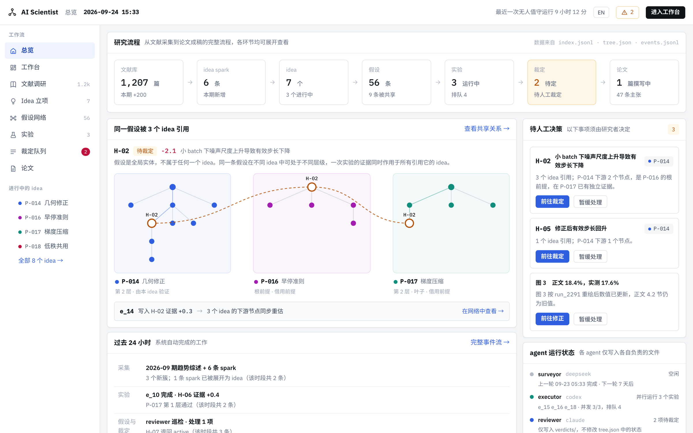

# AI 科学家：动态假设-证据森林系统

[English](README.en.md) · 中文

**[在线演示](https://liuguangrui.top/ai-scientist/)** · [工作台](https://liuguangrui.top/ai-scientist/main) · [假设全景](https://liuguangrui.top/ai-scientist/panorama) · [三维森林](https://liuguangrui.top/ai-scientist/forest3d)

本仓库是一个自动化科研系统的交互界面。系统覆盖文献调研、假设生成、实验执行、证据裁定与论文写作五个环节，
各环节共享同一个假设网络。前端与服务端均无第三方依赖，无需构建步骤。

在线演示仅使用演示数据与模拟实验，全部逻辑在浏览器中执行，操作记录仅保存在访问者本地。

## 核心设计

系统的基本假定是：**假设是全局实体，不从属于任何单个课题。**

同一条假设可以在不同课题的假设树中处于不同位置：在一个课题中是根前提，在另一个课题中是中间节点，
在第三个课题中是已验证的叶子。因此，一次实验产生的证据会同时作用于所有引用该假设的课题；
而当该假设被裁定不成立时，各课题受到的影响按其所处位置分别计算。
模型的完整说明见 [docs/CONCEPTS.zh-CN.md](docs/CONCEPTS.zh-CN.md)（[English](docs/CONCEPTS.md)）。



---

## 功能

界面中的操作均会修改系统状态，并按依赖关系传播到相关界面。

| 操作 | 系统行为 |
| --- | --- |
| 提交实验 | 实验依次经历排队、分配资源、运行与完成。完成后将带符号的证据写入对应假设，所有引用该假设的课题同步更新。模拟时钟独立推进，离开页面期间队列照常消化。 |
| PROCEED / REFINE / PIVOT / 提交裁定 | 连续三次 PIVOT 无改善，或累积证据低于 −1.0 时，executor 停止展开该假设并将其转入裁定队列。 |
| 裁定共享假设 | 影响按位置区分：该假设为根前提的课题整体重估，为中间节点的课题冻结相应分支，拥有独立证据的叶子不受影响。 |
| 立项候选课题 | 选择需要复用的已有假设后，新假设树接入共享网络。被复用的节点仅增加引用关系，不重复验证。 |
| 修订论文 | 修改过度声称会同步改写正文；采纳图表审阅意见后图表重绘，对应小节标记为待复核；存在未处理的过度声称时，投稿版本无法导出，系统列出相应条目。 |
| 浏览假设全景 | 支持缩放、平移与拖动节点；共享假设位于引用它的各课题之间。 |

界面支持中英文切换，语言偏好保存在浏览器中。

---

## 界面

| 分组 | 界面 |
| --- | --- |
| 入口 | `/` 三维森林首页 · `/about` 系统介绍 · `/home` 总览 · `/main` 工作台（可执行假设） |
| 文献调研 | `/survey` 文献采集 · `/trends` 趋势分析 · `/sparks` idea spark · `/digest` 论文详情 |
| 立项与假设 | `/ideas` 立项 · `/panorama` 假设全景 · `/graph` 共享关系 · `/tree` 单课题假设树 · `/forest3d` `/forest2d` 大规模森林（三维 / 二维） |
| 实验 | `/experiments` 单次实验 · `/exptree` 实验树（四阶段）· `/sweep` 参数扫描矩阵 · `/runs` 算力与失败记录 |
| 裁定与写作 | `/review` 裁定队列 · `/paper` 论文正文 · `/claims` 主张与证据对照 · `/figures` 图表 · `/rebuttal` 审稿与修订 |
| 其他 | `/events` 事件流 |

---

## 本地运行

```bash
npm start          # http://localhost:8080
npm test           # 端到端断言测试
```

运行环境为 Node 18 及以上版本。可通过 `PORT=3000 npm start` 指定端口。

每位访问者拥有独立的演示工作区，以 cookie 标识，存储为 `data/sessions/` 下的 JSON 文件；页脚提供重置入口。

---

## 接入真实项目数据

演示模式使用与真实数据结构一致的占位数据。接入真实项目目录的方式如下：

```bash
AIS_SOURCE=project AIS_PROJECT_DIR=/path/to/project npm start
npm run check-project /path/to/project   # 检查目录内容并报告问题
npm run demo-project                     # 使用仓库自带的样例目录
```

系统读取 `tree.json`（课题、假设与假设树）、`experiments.jsonl`、`events.jsonl`、`index.jsonl`（文献）、
`verdicts/`、`venues.yaml`、`topics.md` 以及可选的 `paper/` 目录。文件变更后自动重新读取，无需重启。

在项目模式下，**工作台仅作为决策界面，不承担数据生产职责**。其写入范围限于以下文件：

| 研究者操作 | 写入位置 |
| --- | --- |
| 裁定假设 | `verdicts/<hyp>.json` |
| 提交实验 | 在 `queue.jsonl` 追加一行 |
| 任意操作 | 在 `events.jsonl` 追加一行，`"module": "human"` |

`tree.json`、`index.jsonl`、`experiments.jsonl` 与 `artifacts/` 由各 agent 维护。涉及这些文件的操作会被拒绝并给出原因；
模拟时钟在项目模式下关闭，实验完成时间以 executor 的记录为准。设置 `AIS_READONLY=1` 时系统只读。
格式错误的数据逐行报告而不中断页面；仅有单一语言的字段在两种语言界面中均按原文显示；项目中尚未提供的模块显示为空状态。

完整的字段约定见 [docs/DATA.md](docs/DATA.md)（英文）。

---

## 文档

| 文档 | 内容 |
| --- | --- |
| [docs/CONCEPTS.zh-CN.md](docs/CONCEPTS.zh-CN.md) | 森林模型：共享假设、带符号证据与裁定传播 |
| [docs/DATA.md](docs/DATA.md) | 接入真实项目的文件约定（英文） |

---

## 相关项目

**[hypothesis-forest-3d](https://github.com/liuguangrui-hit/hypothesis-forest-3d)**：本系统假设树模型在大规模下的二维与三维结构可视化，
包含数十个 idea、近千条假设与两千余条带符号证据，呈现共享假设、证据流向与裁定传播。无第三方依赖，可直接在浏览器中打开 `index.html`。

---

## 工程结构

```
server/
  index.js     HTTP 服务、静态文件、/api/view 与 /api/act（无框架）
  seed.js      演示工作区的初始数据，所有字符串均为双语
  engine.js    派生状态：frontier、节点角色、裁定影响、模拟时钟
  views.js     每个界面对应一个视图构造函数，客户端只负责渲染
  actions.js   界面中的每个操作对应一个函数
  input.js     输入校验：长度上限、标识符校验、按语言写入
  store.js     会话工作区持久化（LRU 缓存与磁盘）
  source/      数据源：演示模拟或真实项目目录
  selftest.js  npm test
tools/check-project.js    项目目录检查工具
fixtures/project-sample/  样例项目目录，包含若干有意构造的异常数据
public/
  css/app.css  设计系统
  js/core.js   语言、API、格式化与基础组件
  js/app.js    路由与工作台框架
  js/hero.js   三维森林首页
  js/landing.js
  js/screens/  overview · lit · hyp · exp · write
```

服务端仅提供两个接口：`GET /api/view?screen=<name>` 返回单个界面所需的全部数据，
`POST /api/act {op, args}` 执行一个操作并返回双语提示。**全部业务逻辑位于服务端**，各界面之间的一致性由结构保证。

---

## 部署

### GitHub Pages（在线演示）

在线演示为静态站点，地址为 `liuguangrui.top/ai-scientist/`（账号的 Pages 域名加仓库名）。
推送至 `main` 分支后，[.github/workflows/pages.yml](.github/workflows/pages.yml) 先执行 `npm test`，
再执行 `node tools/build-pages.mjs` 生成 `_site/` 并发布。

静态站点不含服务器。构建时将 `server/` 中的纯逻辑模块（`api`、`views`、`actions`、`engine`、`seed`、`input`）
原样复制到 `js/engine/`，替换为仅支持演示模式的数据源（[tools/pages/source.js](tools/pages/source.js)），
并由 [tools/pages/local.js](tools/pages/local.js) 在浏览器中调用。浏览器与服务器执行的是同一份代码，工作区保存在访问者的 localStorage 中。
`index.html` 通过 `<base href>` 声明站点路径，`404.html` 与之相同，因此 `/ai-scientist/tree?idea=P-014` 等深层链接可直接访问或刷新。
接入真实项目目录需使用 Node 服务器。

本地预览：执行 `npm run build:pages` 后，将 `_site/` 部署在任意静态服务器的 `/ai-scientist/` 路径下；
或执行 `PAGES_BASE=/ npm run build:pages` 生成部署于根路径的版本。

### Render（Node 服务器）

仓库提供 [render.yaml](render.yaml)，用于部署 Render 免费 Node.js Web Service：
使用 `main` 分支，以 `npm install` 构建、`npm start` 启动，健康检查路径为 `/api/health`。
服务监听 `0.0.0.0:$PORT`，固定使用 `AIS_SOURCE=demo`，每位访问者拥有独立会话。
公开部署仅使用演示数据与模拟实验，不应配置真实项目目录、模型密钥或实验执行器。

以 Render Blueprint 连接本仓库后，每次推送至 `main` 均自动部署，部署完成后可检查 `/api/health`。
免费服务在 15 分钟无访问后休眠，再次访问时冷启动约需一分钟；休眠、重启或重新部署会清空演示记录。
每个工作区每月共享 750 个免费实例小时，流量与构建另有额度；请勿启用付费实例、磁盘或数据库。
未绑定付款方式时，额度耗尽将暂停服务或构建；已绑定付款方式的工作区可能产生超额费用。
详见 [Render 免费方案限制](https://render.com/docs/free)。

系统以单个 Node 进程运行，可部署于任意反向代理之后。`data/sessions/` 是唯一需要写权限的目录，其中的会话七天后自动清理。
多实例部署时需将 `server/store.js` 替换为共享存储，其余代码不依赖本地磁盘。

---

## 许可

本仓库**未附带开源许可证**。代码公开可读，但未授予复制、修改或再分发的权利。如需使用，请联系作者。
